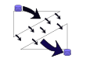
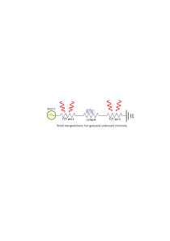

### viamillipede:
Fast, resilient, network transparent pipe transport. 


Viamillipede is client/server program built to improve pipe transport across networks by using multiple TCP sessions. It demultiplexes stdin into multiple buffered TCP connections and then terminates the connections into stdout on another host. Order is guaranteed and the pipe is transparent to the source/sink programs. It is as simple to use as Netcat and can generate large throughputs.

#### Problems With existing approaches:
TCP connections are fragile and IP employs best effort delivery to preserve its economy.  TCP was not engineered for performance, resilience or longevity for a single flow.  Relying on a single TCP connection to succeed or perform is not defendable in software and there are many applications where losing a TCP session is expensive.

### typical pathology:

 + ```tar cf - / | /bin/dd obs=1m 2> /dev/null | /bin/dd obs=1m 2> /dev/null | /usr/local/bin/pipewatcher | ssh dest.yoyo.com "tar xf- "```
 + double serial penalty slow throughput, note latent mistake causing 1B reads
 + Extra pipe steps impose 'serial resistance' to throughput.
 + desperately superstitious optimizations are premature and not generally applicable
 + ssh is not the tool for every situation 
 + a fixed pipeline is not tuned for any system
 + SMP ignorance, Cpu's either lonely forever or hotspotted.
 + underused tx/rx interrupt endpoints, pcie lanes, NIC channel workers, memory lanes and flow control.
 + networks are tuned against hot single tcp connections; that is hard to fix
 + poor mss window scaling. Congestion controls aggressively collapse when network conditions are not pristine.
 + large bandwidth latency product vs. contended lans; both penalized due to 'impedance mismatches') 
 + Poor buffer interactions eg: "Shoe shining" delays. 
 + NewReno congestion control alternatives are not always practical.
 + Flows are stuck on one L1/L2/L3 path.  This defeats the benefits of aggregation and multi-homed connections.
 + Alternate parallel transports are not pipe transparent and require significant configuration; eg: pftp, bittorrent, pNFS, ppcp
 + Your NOC will do maintenance in intervals shorter than your data migration windows. eg: I need to move a petabyte over the wan, but the router is booted every week. 
 + Routers reset/drop/limit single flows for fun sometimes.

#### Goals and Features of viamillipede:

+ Provide:
     + Fast transparent delivery of long lived pipes across typical networks.
     + Runtime SIGINFO inspection of traffic flow.`( parallelism, worker allocation, total throughput )`
     + Resilience against dropped TCP connections and dead links.
+ Increase traffic throughput by:
	+ Using parallel connections that each vie for survival against adverse network conditions.
	+ Using multiple destination addresses with LACP/LAGG or separate Layer 2 addressing.
	+ Permit adequate buffering to prevent shoe shining. 
	+ Return traffic is limited to ACK's to indicate correct operations
+ Specified Traffic Shaping:
     + Steer traffic to preferred interfaces.
     + Use multiple physical or logical IP transports.
     + Use aggregated link throughput in a user specified sorted order.

+ Error resilience: TCP sessions are delicate things
     + Restart broken TCP sessions on alternate transport automatically. 
     + Bypass dead links at startup; retry them later as other network topology changes are detected.
     + self tuning worker count, side chain, link choices and buffer sizes, Genetic optimization topic? `(*)`
     + checksums, not needed, but it's part of the test suite, use the 'checksums' transmitter flag to activate
     + error injection via tx chaos <seed> option - break the software in weird ways,  mostly for the test suite
     + programmable checkphrase  uses a 4 character checkphrase to avoid confusion rather than provide strong authentication

+ Simple to use in pipe filter programs
     + Why hasn't someone done this before? 
     + bbcp
     + udp  protocols
     + IBM's parallel ftp for SP2 z/os, bittorrent: not pipe transparent. 
     + Hide complexity of parallel programming model from users.

#### Examples:

### Simple operation:
+ Start receiver with rx <portnum> and provide a stdout destination 
+ ``` viamillipede rx 8834 > /tmp/despair  ```
+ Start transmitter with  tx <receiver_host> <portnum> and provide a stdin source
+ ``` cat /tmp/Osymandias  | viamillipede tx host1.yoyodyne.com 8834  ```
	     
### Use case with zfs send/recv:
+ Start transmitter with  tx <receiver_host> <portnum>  and provide stdin from zfs send	
+ ``` zfs send dozer/visage | viamillipede tx foriegn.shore.net 8834  ```
+ Start receiver  with rx <portnum>  and ppipe output to zfs recv
+ ``` viamillipede rx 8834   | zfs recv trinity/destset ```
	
### Options:
+ `rx <portnum> ` Become a receiver. Write output to stdout unless initiate is specified.  
	+ If used concurrently with tx; full duplex connections are possible .
	+ If used with initiate it will delay tcp socket startup until there is data in the transport
	+ if used with terminate it will delay reading until the tunneled TCP connection is started
+ `tx <host> <portnum> ` Become a transmitter and add transport graph link toward an rx host. Optionally provide tx multiple times to inform us about transport alternatives. We fill tcp queues on the first entries and then proceed down the list if there is more input than link throughput.  It can be helpful to provide multiple ip aliases to push work to different nic channel workers and balance traffic across LACP hash lanes. Analysis of the network resources should inform this graph. You may use multiple physical interfaces by chosing rx host ip's that force multiple routes.
	+ Read stdin and push it over the network unless terminate is specified. 
	+ Full duplex, rx and tx may be used concurrently to provide a transparent full duplex pipe. Happy shell throwing!
		+ Two distinct port numbers are required, one rx port for each side, with the tx on the other host pointing at the rx
		+ ```host1: ./viamillipede rx  7788 tx host2 9900 charmode ```
		+ ```host2: ./viamillipede rx  9900 tx host1 7788 charmode ```
	+ The source and destination machine may have multiple interfaces and may have:
		+ varying layer1 media ( ethernet, serial, Infiniband , 1488, Carrier Pidgeon, insects, ntb)
		+ varying layer2 attachment ( vlan, aggregation )
		+ varying layer3 routes ( multihomed transport, backup wan, NATed destination IP's) 
	+ Provide tx multiple times to describe the transport graph.
	+ Use the preferred link in the order it's provided in the tx clause. 
	+ Should you saturate  a link,  fill the next available link.
	+ Provide tx the same number of times as the thread count to precisely distribute traffic on specific links
``` viamillipede \
	tx host1.40g-infiniband.yoyodyne.com 9090\
	tx host1a.40g-infiniband.yoyodyne.com 9090\
	tx host1.internal10g.yoyodyne.com 9090\
	tx host1.internal1g.yoyodyne.com 9090\
	tx host1.expensive-last-resort.yoyodyne.com 9090

```

+ terminate <port> listen on the port, connect that port to the destination 
	+ Accept a tcp connection
	+ transmitter or receiver, requires full duplex operation
	+ can be used with initiate to tunnel TCP over viamillipede
+ initiate <hostname> <port> start a tcp socket toward the host and port when a full dupex connection is established
	+ requires full duplex
	+ Create a tcp socket
	+ use with terminate to tunnel a full duplex socket, this example tunnels ssh from host1:9022 to host2:22
```
		host1: ./viamillipede rx  7788 tx host2 9900 charmode terminate 9022
		host2: ./viamillipede rx  9900 tx host1 7788 charmode initiate localhost 22
```

+ charmode
	+ transmitter or receiver
	+ Attempt to deliver any data in the buffer, do not wait for buffers to fill strictly
	+ this will result in very expensive operations and speed will suffer for tinygram writes
+ verbose  <0-20+>, 
	+ transmitter or receiver
	+ SIGUSR1/2 will increase/decrease verbosity
	+ ``` viamillipede rx 8834   verbose 5 ```
+ threads <1-16> control worker thread count 
	+ set only on transmitter
	+ tune this value to suit your need
	+ An upper limit of 16 is statically compiled in, higher thread count is unlikely to be productive. 
	+ A minimum of 3 threads is encouraged to preserve performance and resiliency. 
	+ ``` viamillipede tx foreign.shore.net 8834 threads 16 ```
+ checksum (only on transmitter). 
	+ This is probably not required as the tcp stack and network layer will perform this automatically
	+ part of the verification suite or for the paranoid user
	+ uses a fast, not particularly stellar, method
	+ transmitter only option.
	+ ``` viamillipede tx foreign.shore.net 8834 checksum ```
+ chaos <clock divider> add error via chaos
	+ transmitter only option
	+ could be used to rebalance network links
	+ periodically close sockets to simulate real work network trouble  and tickle recovery code
	+ deterministic for how many operations to allow before a failure
	+ ``` viamillipede tx localhost 12334 chaos 1731```
+ checkphrase <char[4]> provide lightweight guard against a stale or orphaned receiver,
	+ not a security/authentication mechanism
	+ Transmitter and Receiver word[4] must match exactly.
	+ ``` viamillipede tx localhost 12334 checkphrase wat!```
	+ ``` viamillipede rx 12334 checkphrase wat!```
+ prbs <seed[uint16]> generate and verify a pseudorandom bitstream to stress test the transport
	+  ``` viamillipede prbs 0xd00f tx localhost 3434 rx 3434 ```
	+ Will not terminate.
	+ bitstream is only random enough for me and will not survive cryptanalysis
	+ can be used to confuse dedup or compression
	+ will always generate the same data given the seed
	+ verification step can be run separately from generation
	+ tx will generate the bitstream
	+ rx will verify the bitstream and leave it on stdout
+ leglimit <long> stop after a number of legs
	+ use to provide a bounded transmission length
	+ measured in 2MiB chunks
+ delayus <long> delay N  microseconds
	+ cap throughput crudely
	+ delay applied to every 2MiB   boundary


### Use outboard crypto: viamillipede does not provide any armoring against interception or authentication
+ use ipsec/vpn and live with the speed
+ provide ssh tcp forwarding endpoints
	+ from the tx host:` ssh -N -L 12323:localhost:12323 tunneluser@rxhost `
	+ use multiple port instances to  get parallelism
	* use a trusted peers tcp encapsulation tunnel to offload crypto
+ use viamillipede to armour ssh connections
	+ not recommended for poor performance
	+ for the target ``` viamillipede charmode initiate localhost 22 tx txhost 4545 rx 5555 ```
	+ from the source ``` viamillipede charmode terminate 8022  tx rxhost 5555 rx 4545 ```
	+ the use the alternate ssh port  on the source ``` ssh -p 8022 localhost ```

+ use openssl in  stream, take your crypto into your own hands
	+ ` /usr/bin/openssl enc -aes-128-cbc -k swordfIIIsh -S 5A  `
	+ choose a cipher that's binary transparent  
	+ appropriate  paranoia vs. performance up to you
	+ enigma, rot39, morse?

### Check the smoke.sh testscript  for detailed examples of possible uses. 

### Theory of operation

### Future plans  `(*)` 
	+  work in progress, because "hard * ugly > time"
	+ Make additional 'sidechain' compression/crypto pipeline steps parallel.
     		+ hard due to unpredictable buffer size dynamics
        	+ sidechains could include any reversable pipe transparent program
        	+ gzip, bzip2
        	+ openssl
        	+ rot39, od
	+ xdr/rpc marshalling for architecture independence
 		+ serializing a struct is not ideal
	+ reverse channel capability  *done 20180830
		+ millipedesh ? millipederpc?
		+ specify rx/tx at the same time + fifo?
		+ is this even a good idea? Exploit generator?
		+ provide proxy transport for other bulk movers: 
			+ rsync 
			+ ssh 
			+ OpenVPN
		+ error feedback path more that ack
		+ just run two tx/rx pairs?

