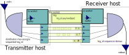

### viamillipede:

RAID for TCP.

Viamillipede is client and server program built to improve network pipe transport using multiple TCP sessions.  It multiplexes a single network pipe into multiple TCP connectons and then terminates the connections into a pipe transparently on another host.  It is similar to the simplest mode of remote pipe transparency of Netcat with the parallelism from iperf.


#### Problems With existing approaches:

+ Single TCP connections are friable
     + typical pathology:
     +  `/bin/dd obs=1m 2> /dev/null | /bin/dd obs=1m 2> /dev/null| /usr/local/bin/pipewatcher` 
          + double serial penalty, note latent mistake  causing 1B reads
          + desperately superstitious 
     + `# replcmd = '%s%s/usr/local/bin/pipewatcher $$ | %s "%s/sbin/zfs receive -F -d \'%s\' && echo Succeeded"' % (compress, throttle, sshcmd, decompress, remotefs)
 `
          + ssh is not the tool for every situation 
	  + fixed pipeline is not tuned for any system
	  + keep interpreted(y) lanuages out of plumbing
 + SMP igorant, Cpu's lonely forever.
 + underused tx/rx interrupt enpoints, pcie lanes, channel workers, memory lanes and flow control concurrency controls idled.
 + network hardware is tuned against hot single tcp connections
 + Poor mss window scaling. Congestion controls aggressively collapse mss when network conditions are not pristine.
 + Long bandwidth latency product connections vs. short skinny pipes; niether work out of the box due to 'impedence mismatches' ( not really Z !) 
 + Poor buffer interactions. "Shoe shining" when buffer sizing is not appropriate. Taoe libaries muxed connections soon after helical  type drives. 
 + NewReno alternatives are not often acceptable.
 + Flows are stuck on one L3 path.  This defeats the benefits of aggregation and multi-homed connections.
 + Alternate Scatter gather transport is usually not pipe transparent and difficult to set up; eg: pftp, bittorrent, pNFS


#### Goals and Features of viamillipede:
+ Simple to use in pipe+filter programs
     + too simple?
     + Why hasn't someone done this before?
     + clear parallel  programming model
     + nothing parallel is clear, mind boundary conditions against transporter accidents. 
+ Provide:
     + Sufficent buffering for throughput.
     + Runtime SIGINFO inspection of traffic flow.`( parallelism, worker allocation, total throughput )`
     + Resilience against dropped TCP connections.`(*)`
+ Increase traffic throughput by:
     + Using parallel connections that each vie for survival against scaling window collapse.
     + Using multiple destination addresses with LACP/LAGG or separate Layer 2 adressing.
+ Intelligent Traffic Shaping:
     + Steer traffic to preferred interfaces.
     + Dynamically use faster destinations if preferred interfaces are clogged.
+ Make additional 'sidechain' compression/crypto pipeline steps parallel. `(*)`
     + hard due to unpredictable buffer size dynamics
     + sidechains could include any reversable pipe transparent program
          + gzip, bzip2
          + openssl
          + rot39, od
+ Architecture independence `(*)`
     + xdr/rpc marshalling 
     + reverse channel  capablity 
          + millipedesh ? millipederpc?
	  + provide proxy trasport for other bulk movers: rsync, ssh OpenVPN
	  + error feedback path
	  + just run two tx/rx pairs?
+ Error resiliance `(*)`
     + dead link bypass ` (*)`
     + very long lived TCP sessions are delicate things;
     + Your NOC wants to do maintenance and you must have a week of pipeline to push
     + restart broken legs on alternate connections automatically `(*)`
     + self tuning worker count, side chain, link choices and buffer sizes, Genetic optimization topic?
     + checksums

`(*)` denotes work in progress, because "hard * ugly > time"

#### Examples:

+ trivial operation
     + Configure receiver  with rx <portnum>
	` viamillipede rx 8834  `
     + Configure transmitter with  tx <receiver_host> <portnum> 
	` echo "Osymandias" | viamillipede tx foreign.shore.net 8834  `
+ verbose  <0-20>
	` viamillipede rx 8834   verbose 5 `
+ control worker thread count (only on transmitter) with threads <1-16>
	` viamillipede tx foreign.shore.net 8834 threads 16 `
+ use with zfs send/recv
     + Configure transmitter with  tx <receiver_host> <portnum>  and provide stdin from zfs send	
     + ` zfs send dozer/visage | viamillipede tx foriegn.shore.net 8834  `
     + Configure receiver  with rx <portnum>  and ppipe output to zfs recv
     +	`viamillipede rx 8834   | zfs recv trinity/broken `

+ explicitly distribute load to reciever with multiple ip addresses, preferring the first ones used
     + Use the cheap link, saturate it, then fill the fast (north) transport and then use the last resort link (east) if there is still source and sync throughput available.
     + The destination machine has three interfaces and may have:
          + varying layer1 media ( ether, serial, Infiniband , 1488, Carrier Pidgeon, Bugs)
          + varying layer2 attachment ( vlan, aggregation )
          + varying layer3 routes
     + `viamillipede tx foreign-cheap-1g.shore.net 8834 tx foreign-north-10g.shore.net 8834  tx foreign-east-1g.shore.net 8834 `


```
TOP:
	scatter gather transport via multiple workers
	feet  are the work blocks
	start workers
	worker states
		idle
		working
	the window is the feet in flight
		window:
			foot (footid)
			stream start =  footid * footsize
			stream end =  (footid + 1) * footsize
			window [firstfoot, lastfoot]  ... heap? sorted for min foot out?

	sequence recieved feet to receate stream in order
	supervise the results relaibly.
	retrnsmit failed feet
	maximize throughput vs window vs latency product

	Retry broken transport works
```
